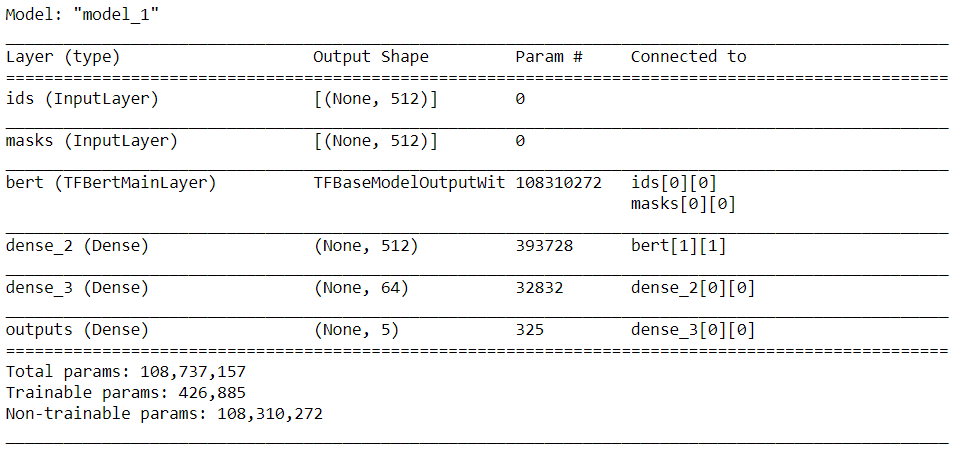

# Model design:

## Model Description
The model was a simple model built with a single embedding BERT layer and two Dense layers. The model may have performed far better with an additional Dropout / Conv1D layer. Will attemp the same in the next few experiments

 

## Links:
Model built for the batches of 16 samples:
<ul>
  <li>https://drive.google.com/drive/folders/1O4WGG6J26Q-umVjiKlnjKeLUFXKYf1eR?usp=sharing </li>
<li>.h5 file: https://drive.google.com/file/d/1-N4ppa65F68lwiq4YlieWhaUr3Z2Dj1a/view?usp=sharing</li>
</ul>

Model built for batches of 32 samples:
<ul>
<li>https://drive.google.com/drive/folders/1nSQ9U0UKXN-v0pilD_2eaH3m15Sjie4t?usp=sharing</li>
<li>.h5 file: https://drive.google.com/file/d/1-Gu1yx84fNveuxFDleCOdVxTElfbKDbP/view?usp=sharing</li>
</ul>
